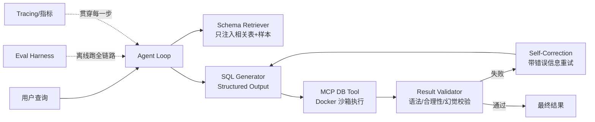

# QueryAgent — 整体设计框架

> Text-to-SQL 数据分析 Agent：自建评测体系 + 可靠性链路。
> 本文是 Agent 核心设计，供实现时逐条对齐。Web Demo、PostgreSQL 迁移和阶段验收见 `docs/WEB_DEMO_DESIGN.md`；配套 `AGENTS.md` 约定工作规则。

---

## 1. 背景与目标

**背景**：秋招 Agent 开发岗面试，需要一份"能聊出底层实现、能拿出数据"的项目。通用 LLM 聊天 demo 无竞争力；面试官要的是：懂 agent loop、懂可靠性、懂评测、懂 MCP。

**目标**：一个 Text-to-SQL agent，从自然语言查询生成并执行 SQL，用**可复现的评测数字**证明其可靠性改进。

**成功标准（可量化）**：
- 在离线评测集上给出 execution accuracy / exact match。
- 可靠性链路（校验 + 自纠正）有对照实验，成功率可复现提升（如 62% → 81%）。
- tracing 能定位"哪一步最常失败"。

## 2. 范围

**做（In Scope）**：
- agent loop（规划 → 生成 SQL → 执行 → 校验 → 自纠正）
- schema 感知与上下文管理
- MCP 封装的数据库工具
- 幻觉/错误检测 + 自纠正
- 离线评测 harness（数据集、指标、tracing、成本统计）
- Qwen 与闭源模型对照评测

**不做（Out of Scope，避免 scope creep）**：
- 不训练/微调模型（除非后续明确需要）
- 不做完整的多 agent 编排（本项目单 agent）
- 不做生产级高并发服务（评测调度层可选 Go 是加分项，非必需）
- 不做公网部署、账号系统和手机端适配；提供面向桌面浏览器的本地 React/Vite 展示界面

## 3. 系统架构



## 4. 数据流（一次查询的完整链路）

1. **解析**：用户自然语言查询 + 多轮对话历史。
2. **Schema 感知**：从全库 schema 中检索相关表 + 少量样本数据，注入 prompt（控制 token）。
3. **生成**：LLM 以 Structured Output 输出候选 SQL（JSON Schema 卡死字段）。
4. **执行**：通过 MCP 工具在 Docker 沙箱内执行 SQL，返回结果或报错。
5. **校验**：结果校验器检查（a）SQL 语法/执行是否成功（b）结果合理性（列数、空集、值域）（c）是否幻觉引用了不存在的表/列。
6. **自纠正**：校验失败 → 把错误信息回灌给 LLM → 重新生成，最多 N 轮。
7. **返回**：通过后返回结果；超步数/超轮次则降级返回并标记。

## 5. 模块详细设计

### 5.1 `agent/` — Agent Loop 主控

- **职责**：编排 plan → tool_call → observe → 判断完成 → 循环。
- **关键设计**：
  - 最大步数限制（如 5 步）、最大自纠正轮次（如 3 轮）。
  - 每步状态机：`PLANNING / GENERATING / EXECUTING / VALIDATING / CORRECTING / DONE / FAILED`。
  - 上下文累积策略：把每步的观察结果按需裁剪后追加，防上下文腐化。
- **考点映射**：Agent 系统设计、循环控制、异常处理。

### 5.2 `llm/` — 模型客户端

- **职责**：统一封装闭源 API 与 Qwen 开源模型，输出统一接口。
- **关键设计**：
  - 抽象接口 `LLMClient.generate(prompt, schema) -> StructuredResult`。
  - Structured Output 走 JSON Schema（+ Pydantic 校验）。
  - 记录每次调用的 token 消耗、成本、延迟（供评测）。
- **考点映射**：Structured Output、推理成本。

### 5.3 `tools/` — MCP DB 工具

- **职责**：把"查询数据库"封装成标准 MCP tool（而非硬编码函数）。
- **关键设计**：
  - 暴露 `query(sql) -> result` 一个核心 tool；schema 查询走 `get_schema`/`get_sample`。
  - 执行在 Docker 沙箱，限制：只读、超时、行数上限、禁止多语句/危险关键字。
  - 密钥与连接串不进 prompt，权限白名单。
- **考点映射**：MCP 深入理解、工具调用安全。

### 5.4 `schema/` — Schema 感知与上下文管理

- **职责**：从大 schema 中选出相关表 + 样本，控制注入 token。
- **关键设计**：
  - 候选生成：语义相似度（表名/列名/注释 embedding）+ 关键词匹配混合。
  - 相关表选择后，注入 DDL + 每表少量样本行。
  - token 预算控制：注入内容超限则按相关性截断。
- **考点映射**：上下文窗口管理、Lost in the Middle、RAG 检索策略。

### 5.5 `reliability/` — 结果校验与自纠正

- **职责**：降低幻觉与错误，提升成功率。
- **三层校验**：
  1. **语法/执行校验**：SQL 解析 + 执行是否成功（捕获 DB 报错）。
  2. **合理性校验**：列数匹配、空集判断、值域合法性。
  3. **幻觉检测**：引用不存在的表/列 → 检测 → 回灌错误 → 自纠正。
- **自纠正**：错误信息作为 feedback 回灌 prompt，重新生成，最多 N 轮。
- **考点映射**：幻觉控制、Function Calling 错误处理。

### 5.6 `eval/` — 评测 Harness（项目灵魂）

- **职责**：离线跑全链路，产出可复现指标。
- **数据集**：BIRD 子集 + 自造 100 条中文业务查询（覆盖多表 join、聚合、嵌套、条件过滤、多轮）。
- **指标**：execution accuracy、exact match、平均步数、token 消耗、单查询成本、平均延迟。
- **对照实验**：逐项开启可靠性特性（self-correction、schema 选择、rerank），记录每项的准确率/成本增量。
- **考点映射**：评测方法论、成本优化。

### 5.7 `observability/` — Tracing 与指标

- **职责**：记录每一步（prompt、tool_call、输出、token、耗时、成本）。
- **关键设计**：span 结构，能回答"哪一步最常失败、哪步最贵"。
- **考点映射**：可观测性、定位失败。

## 6. 可靠性设计汇总

| 层 | 手段 | 解决什么 |
|---|---|---|
| 生成 | Structured Output + JSON Schema | 输出格式不可解析 |
| 执行 | 沙箱 + 只读 + 超时 + 行数上限 | 工具调用安全 |
| 校验 | 语法 / 合理性 / 幻觉检测 | 错误 SQL、编造表列 |
| 纠正 | 错误回灌重试（≤3 轮） | 一次性失败 |
| 上下文 | schema 选择 + token 预算 + 历史裁剪 | 上下文腐化、成本失控 |

## 7. 评测体系设计

- **数据集来源**：BIRD（英文）、Spider（英文）+ 自造中文业务集（本地化 + 可多轮）。
- **核心指标**：
  - `execution accuracy`：SQL 执行结果与标准答案一致（主指标）。
  - `exact match`：SQL 文本与标准 SQL 语义等价。
  - 效率指标：平均步数、平均 token、单查询成本、平均延迟。
- **对照实验模板**（每个可靠性特性都跑一遍）：

```
基线（无校验无纠正）：  成功率 A%
+ Structured Output：   A → B%
+ 自纠正重试：          B → C%
+ schema 选择：         C → D%（同时测成本变化）
```

- **tracing**：每步 span，失败案例可回溯定位。

## 8. 技术选型明细

| 项 | 选择 | 备注 |
|---|---|---|
| 语言 | Python 3.11+ | 可选 Go 写评测调度层 |
| 模型 | 闭源 API + Qwen 开源对照 | Qwen 用 vLLM 或官方 API |
| 结构化输出 | JSON Schema + Pydantic v2 | |
| 数据库 | PostgreSQL + pgvector | 正式 Demo 唯一数据源；不保留 SQLite 运行路径 | |
| 执行隔离 | PostgreSQL 只读角色 + statement_timeout + 行数上限 | MCP 服务端是唯一执行边界 | |
| MCP | 官方 MCP SDK（Python） | PostgreSQL Server 作为独立 stdio 子进程 | |
| Tracing | Langfuse / OpenTelemetry | 可自建轻量版 |
| 依赖管理 | uv 或 pip + pyproject.toml；Docker Compose 一键启动 | |

## 9. 里程碑（4~6 周）

| 阶段 | 交付 | 验收 |
|---|---|---|
| W1 | 工程骨架 + LLM 客户端 + 最小 agent loop | 能对单条查询生成并执行 SQL |
| W2 | 评测 harness + 数据集 + 基线数字 | 跑出基线成功率 |
| W3 | schema 感知 + 上下文管理 | 复杂 schema 下成功率提升 |
| W4 | 可靠性链路（校验 + 自纠正） | 对照实验：成功率 X→Y |
| W5 | MCP 工具层 + 沙箱 + tracing | 安全执行 + 可定位失败 |
| W6 | Qwen 对照 + 评测报告 | 完整数字 + 简历版项目描述 |

## 10. 验收标准

1. 离线评测集上 execution accuracy 可复现，且可靠性特性有对照提升。
2. 能定位"哪一步最常失败"（tracing 证据）。
3. Qwen 与闭源模型有对照评测结果。
4. 产出一段可写进简历的量化描述（成功率/成本/延迟数字齐全）。

## 11. Web Demo 与 PostgreSQL 迁移补充

正式展示版本统一采用 PostgreSQL + pgvector。用户通过 Docker Compose 启动 PostgreSQL、FastAPI 后端和 Nginx/React 前端，唯一访问地址为 `http://localhost:5173`。Agent 通过 `MCPExecutor` 与独立 PostgreSQL MCP Server 子进程通信，不直接访问 DSN。

聊天、数据浏览、搜索和 CSV 导出全部经过 MCP；数据库初始化和固定数据重置是唯一允许后端直连 PostgreSQL 的维护操作。数据浏览、角色切换、多会话、SSE、Provider 故障转移、实时评测和启动状态页的详细约束见 `docs/WEB_DEMO_DESIGN.md`。

SQLite 代码和数据只作为迁移阶段的历史基线，Phase 1 完成后从正式运行路径删除；迁移期间不得把 SQLite 新能力作为产品功能继续扩展。

## 12. 风险与取舍

| 风险 | 取舍/缓解 |
|---|---|
| 评测集太小数字不可信 | 优先保证可复现，再扩数据集 |
| 闭源 API 成本 | 用中小模型跑开发，最终用主模型出报告数字 |
| 自纠正导致成本上升 | 对照实验同时记录成本，权衡准确率 vs 成本 |
| scope 膨胀（加 UI、加多 agent） | 严守第 2 节范围，单 agent 做透 |
